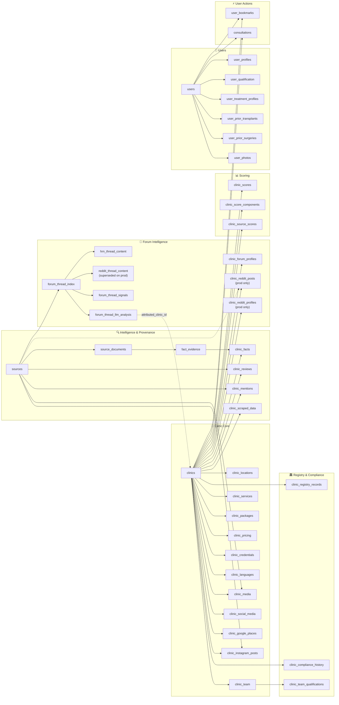

# Database Overview

**Platform:** Supabase (hosted PostgreSQL)  
**Client:** `@supabase/supabase-js` v2 — no ORM, raw SQL migrations  
**Type safety:** Generated TypeScript types at `lib/supabase/database.types.ts` (`npm run db:types`)  
**Migrations:** `/supabase/migrations/` — 26 local migration files from Feb 2026 → May 2026  
**Tables (production):** 43 tables across 7 domains + 1 view + 2 PL/pgSQL functions  
**Tables (local):** 41 tables — missing `clinic_reddit_posts` and `clinic_reddit_profiles`

> **Local and production are nearly fully synced.** The `supabase migration list` output looks alarming (9 local-only migrations, 1 remote-only), but the actual schema differences are minor — the changes were applied to prod manually rather than via `supabase db push`. See [Drift Summary](#local--production-drift) for the real differences.

---

## Local ↔ Production Drift

As of **2026-06-09**. Run `npx supabase migration list` to check current state.

### Actual schema differences (3 items)

| Difference | Local | Production |
|---|---|---|
| `clinic_reddit_posts` table | Does not exist | Exists — empty, pipeline not yet implemented |
| `clinic_reddit_profiles` table | Does not exist | Exists — empty, pipeline not yet implemented |
| `user_profiles.first_name/last_name` | Nullable | NOT NULL |
| `clinic_reviews` unique constraint | `(clinic_id, source_id, review_text, review_date)` | `(clinic_id, review_text, review_date)` — `source_id` removed |

### Migration bookkeeping is out of sync (not a schema problem)

`supabase migration list` shows 9 local-only migrations and 1 remote-only migration, but all the underlying schema changes exist in both environments — they were applied to prod manually rather than through `supabase db push`. The databases are functionally equivalent for everything except the three items above.

To clean up the bookkeeping without touching the schema, run:
```bash
npx supabase migration repair --status applied <migration_id>
```
for each of the 9 local-only migrations, and pull the remote-only one:
```bash
npx supabase migration pull
```

---

## Architecture Diagram

> Reflects the production schema. Tables marked `[local only]` exist locally but haven't been pushed to prod.



---

## Domain Breakdown

### 1. Clinic Core

The central entity is `clinics`. Everything in this domain hangs off it via FK with `ON DELETE CASCADE`.

| Table | Status | Purpose |
|---|---|---|
| `clinics` | Both | Root entity. One row per clinic. Holds identity fields: name, city, website, contact info, thumbnail, status. |
| `clinic_locations` | Both | Physical addresses with coordinates, opening hours (jsonb), and payment methods. A clinic can have multiple locations; `is_primary` flags the main one. |
| `clinic_team` | Both | Staff roster. Each member has a `role` enum (surgeon, coordinator, nurse, etc.), a `doctor_involvement_level`, and verified identity fields: `name_normalized`, `external_ids`, `last_verified_at`. |
| `clinic_services` | Both | What procedures a clinic offers, typed by `service_category` and `service_name` enums. Intentionally lightweight — just a signal, not a price list. |
| `clinic_packages` | Both | All-in packages (grafts, nights, transport, aftercare, price range). Structured separately from pricing because packages bundle multiple things that don't map cleanly to a single service price. |
| `clinic_pricing` | Both | Per-service price ranges. Sourced and verified separately from packages. Currently unpopulated on both local and prod. |
| `clinic_credentials` | Both | Licenses, accreditations, memberships (e.g. ISHRS, JCI). Currently unpopulated on prod — and the anon SELECT grant hasn't been applied to prod yet, so the frontend receives empty results even when rows exist. |
| `clinic_languages` | Both | Which languages a clinic supports and how (staff, translator, on-request). Currently unpopulated. |
| `clinic_media` | Both | Images, videos, before/after photos. Unique on `(clinic_id, url)`. One primary image enforced via partial unique index. Anon SELECT grant missing on prod until `20260505` is applied. |
| `clinic_social_media` | Both | Per-platform social account data (handle, follower count, verified status, bio). Unique on `(clinic_id, platform, account_handle)`. |
| `clinic_google_places` | Both | Google Maps data (place ID, star rating, review count). Kept separate from `clinics` because it's sourced/refreshed independently. |
| `clinic_instagram_posts` | Both | Full scraped post data (likes, comments, hashtags, display URL, engagement). Unique on `(clinic_id, instagram_post_id)`. |

---

### 2. Intelligence & Provenance

This domain tracks *where data came from* and *what we learned from it*. The design intention is full auditability — every fact has a traceable source.

| Table | Status | Purpose |
|---|---|---|
| `sources` | Both | A single scraped URL/document capture. Typed by `source_type`. `content_hash` unique constraint prevents duplicate ingestion. Anon SELECT grant missing on prod until `20260505` is applied. |
| `source_documents` | Both | The actual content extracted from a source (raw text, HTML, PDF). Separated from `sources` because a single URL visit can yield multiple documents. |
| `clinic_facts` | Both | **EAV table.** One row per `(clinic_id, fact_key)`. Holds heterogeneous scraped intelligence — Google ratings, Instagram metrics, opening hours presence, etc. The custom `upsert_clinic_facts()` function preserves `first_seen_at` while updating `last_seen_at` on conflict. Anon SELECT grant missing on prod until `20260505` is applied. |
| `fact_evidence` | Both | Links a clinic fact back to the specific source document snippet that supports it. Provides drill-down traceability. |
| `clinic_reviews` | Both | Structured review rows (rating + text + date). Unique constraint differs: local uses `(clinic_id, source_id, review_text, review_date)`, prod uses `(clinic_id, review_text, review_date)` — source_id was dropped from the key on prod. Anon SELECT grant missing on prod until `20260505` is applied. |
| `clinic_mentions` | Both | Unstructured mentions tagged by topic and sentiment. `clinic_id` is nullable — designed for a two-phase pipeline where scraping happens first and clinic attribution resolves later. In practice this pattern was never implemented; attribution instead happens at the LLM layer via `forum_thread_llm_analysis.attributed_clinic_id`. Table is empty on both local and prod. |
| `clinic_scraped_data` | Both | Raw staging table for scraper output. ~35 columns. Uses `bigserial` PK (inconsistent with the rest of the schema — see Weaknesses). |

---

### 3. Forum Intelligence

Both HRN and Reddit use the hub-and-spoke architecture. `clinic_forum_profiles` is the active aggregated summary table read by the scoring pipeline and frontend for both sources. Two additional flat Reddit tables (`clinic_reddit_posts`, `clinic_reddit_profiles`) exist on prod only — they were created as an experiment but the pipeline was never rewritten to use them and they are empty orphans.

| Table | Status | Purpose |
|---|---|---|
| `forum_thread_index` | Both | **Hub table.** One row per thread regardless of source. Holds universal fields: URL, title, author, date, reply count, clinic attribution. `clinic_id` is nullable — threads are scraped first with `clinic_id = null`, then attributed in a separate step by `forum-attribute-threads.ts`. Threads that don't match any of the 27 clinics (general discussions, unrecognised clinic names, etc.) stay unattributed permanently. See [forum-scraping-schema.md](../forum-scraping-schema.md) and [hrn-implementation.md](../hrn-implementation.md) for the full ingestion pipeline. |
| `hrn_thread_content` | Both | **HRN-specific extension** (1:1 with `forum_thread_index`). Section ID, view count, pages, OP text/HTML, image URLs, scrape strategy, sitemap metadata. Active and used. |
| `reddit_thread_content` | Both | **Reddit-specific extension** (1:1 with `forum_thread_index`). Subreddit, post type, body, score, is_firsthand, parent_thread_id. Active — the Reddit pipeline writes here, same as HRN writes to `hrn_thread_content`. |
| `forum_thread_signals` | Both | **EAV for deterministic signals.** Per-thread signals extracted by regex/keyword matching. Versioned by `extraction_version`. |
| `forum_thread_llm_analysis` | Both | **LLM-derived analysis per thread.** Attributed clinic/doctor, sentiment, satisfaction, summary, topics, repair case flag. `is_current` flag allows historical versioning. |
| `clinic_forum_profiles` | Both | **Aggregated per-clinic-per-source summary.** Pre-computed thread counts, sentiment distribution, pros/concerns. Active and used — this is the table the scoring pipeline and frontend read for forum data. |
| `clinic_reddit_posts` | **Prod only** | **Abandoned experiment.** Flat Reddit post table linked directly to `clinics`. Empty — the pipeline was never rewritten to use this and continues to use `reddit_thread_content` instead. Can be dropped. |
| `clinic_reddit_profiles` | **Prod only** | **Abandoned experiment.** Flat Reddit aggregated profile. Empty — same situation as `clinic_reddit_posts`. Can be dropped. |

---

### 4. Scoring

Three-layer scoring architecture designed to be transparent and debuggable.

| Table | Status | Purpose |
|---|---|---|
| `clinic_score_components` | Both | **Layer 1 — raw components.** Named component scores (currently `reputation` at weight 0.6 and `evidence_transparency` at weight 0.4). Local has a unique constraint on `(clinic_id, component_key)` to prevent concurrent scoring races — not yet on prod. |
| `clinic_source_scores` | Both | **Layer 2 — per-source breakdowns.** Scores per source (google / reddit / instagram) with `metrics_json` and `breakdown_json` for explainability. `is_current` flag allows versioning. |
| `clinic_scores` | Both | **Layer 3 — overall roll-up.** One row per clinic (PK = `clinic_id`). Overall score 0–100, band A/B/C/D. |
| `clinics_with_scores` *(view)* | Both | `clinics` LEFT JOIN `clinic_scores` LEFT JOIN `clinic_google_places`. Used by the listing page for DB-level `ORDER BY score`. |

---

### 5. Registry & Compliance

| Table | Status | Purpose |
|---|---|---|
| `clinic_registry_records` | Both | Turkish Ministry of Health license records. License number, status, specialties, legal name, registry URL. Unique on `(clinic_id, source, license_number)`. |
| `clinic_compliance_history` | Both | Historical compliance events: disciplinary actions, suspensions, fines, reinstatements. Append-only — rows are never updated. |
| `clinic_team_qualifications` | Both | Doctor-level credential verification. Links a team member to an external registry (ISHRS, IAHRS, TPRECD) with source URL and verified date. Unique on `(team_member_id, source)`. Only table with RLS enabled. |

---

### 6. Users

User onboarding data split across tables by concern. All tables have `deleted` soft-delete columns and `update_updated_at_column()` triggers.

| Table | Status | Purpose |
|---|---|---|
| `users` | Both | Auth bridge. `auth_id` stores the Supabase auth UID. One row per registered user. |
| `user_profiles` | Both | Personal info: name, DOB, gender, nationality, timezone, profile picture. `first_name` and `last_name` are **NOT NULL on prod**. Local has them nullable (the nullable migration `20260416000000` was reversed on prod). |
| `user_qualification` | Both | Onboarding wizard answers: age tier, country, hair loss pattern, budget, timeline, WhatsApp number. 1:1 with `users`. |
| `user_treatment_profiles` | Both | Medical profile: Norwood scale, donor area quality/availability, prior transplant flag, allergies, medications. 1:1 with `users`. |
| `user_prior_transplants` | Both | History of previous transplants (year, grafts, country). 1:many with `users`. |
| `user_prior_surgeries` | Both | History of other relevant surgeries. 1:many with `users`. |
| `user_photos` | Both | Hair photos for assessment (front, left side, right side, top, donor area). Unique on `(user_id, photo_view)`. Stored in Supabase Storage bucket `user-photos`. |

---

### 7. User Actions

| Table | Status | Purpose |
|---|---|---|
| `user_bookmarks` | Both | Saved clinics. Unique on `(user_id, clinic_id)`. |
| `consultations` | Both | Consultation requests. `status` enum: pending → in_progress → completed/cancelled. Partial unique index enforces one pending request per `(user_id, clinic_id)`. |

---

## Architecture Decisions

### EAV for `clinic_facts`
Scraped intelligence is heterogeneous — a fact about Instagram engagement rate and one about a Google rating have nothing structurally in common. A fixed-column table would require a schema migration every time a new signal is added. EAV lets the scraper define new fact keys without touching the schema. The tradeoff is weaker type enforcement per fact, mitigated by the `value_type` enum + `fact_value` jsonb pairing.

### Hub-and-spoke for forum tables (HRN)
HRN threads have very different content structures from other forum sources. Rather than one `forum_threads` table with 30 nullable columns, the hub (`forum_thread_index`) holds the universal fields and each platform gets its own 1:1 extension table. This pattern remains active for HRN. Reddit was moved off it (see below).

### Pre-aggregated forum profiles
Computing thread counts, sentiment distributions, and notable threads at query time would require aggregating across thousands of forum rows on every page load. `clinic_forum_profiles` acts as a materialised summary computed by the pipeline and stored. The frontend and scoring pipeline read one row per clinic instead of aggregating at runtime. This pattern is shared by both HRN and Reddit — both pipelines write into `clinic_forum_profiles` keyed by `(clinic_id, forum_source)`.

### Layered scoring (`components` → `source_scores` → `overall`)
Rather than a single opaque score, the pipeline writes three levels. This makes the score auditable: you can see that Clinic X scored 88 because `reputation` was 91 and `evidence_transparency` was 83, and drill further into why Reddit gave 7.6. Components can be recomputed independently without touching the overall roll-up.

### Versioned LLM analysis
`forum_thread_llm_analysis` rows are never updated — new model runs insert a new row and flip `is_current`. This means if a model update changes a clinic's attributed sentiment, the old analysis is preserved for comparison. Same pattern applies to `clinic_source_scores.is_current`.

### Seed data in migrations
Real clinic rows (27 clinics, 47 doctors locally) are inserted inside migration files, not a separate seed script. A fresh `supabase db reset` gives a working database without a separate seed step. Inserts use `ON CONFLICT DO NOTHING` so they're safe to replay against prod.

---

## Strengths

- **Full source traceability.** Every fact, review, and score can be traced back to a source URL via `sources` → `source_documents` → `fact_evidence` → `clinic_facts`.
- **Score auditability.** Three-layer scoring means no black-box scores — every number is explainable to the component level.
- **Idempotent migrations.** Real data is seeded via migrations with conflict guards, making local setup and prod deploys safe to replay.
- **jsonb for semi-structured fields.** `opening_hours`, package `includes/excludes`, `metrics_json` in scores, `evidence_snippets` in LLM analysis — jsonb is used where a fixed schema would be premature, structured columns where the shape is known.
- **Soft deletes on user data.** All user tables have `deleted` flags — correct for medical/GDPR-adjacent data.
- **Extensible forum hub for HRN.** Adding a new forum source requires only a new extension table, not a schema change to existing tables.

---

## Weaknesses & Known Debt

| Issue | Severity | Notes |
|---|---|---|
| **RLS disabled on 40/41 tables** | Critical (before launch) | Only `clinic_team_qualifications` has RLS (and it's local-only). `users`, `user_profiles`, `user_qualification`, `user_treatment_profiles`, `user_photos`, `consultations`, and `user_bookmarks` need row-level policies before real users touch the app. Clinic tables can stay grant-based (public read data) but user-owned tables must not. |
| **Migration bookkeeping out of sync** | Low | Schema changes were applied to prod manually rather than via `supabase db push`, so `migration list` looks alarming but the schema is actually fine. Run `migration repair` + `migration pull` to clean up the history before using `db push` going forward. |
| **Orphan flat Reddit tables on prod** | Low | `clinic_reddit_posts` and `clinic_reddit_profiles` exist on prod but are empty and unused — the pipeline was never rewritten to use them. Should be dropped via a migration. |
| **`users.auth_id` is `text`, not a FK** | High | Should be `REFERENCES auth.users(id) ON DELETE CASCADE`. The current `text` column allows orphaned `public.users` rows if a Supabase auth user is deleted. |
| **EAV ↔ structured table boundary is implicit** | Medium | `clinic_facts` holds scraped signals (Google rating, Instagram metrics). `clinic_google_places` and `clinic_social_media` hold canonical structured versions of some of the same data. The rule ("facts = intelligence signals, structured tables = entity data") lives only in developers' heads, not in any constraint. |
| **`analyses` table is an orphan** | Low | No FK to any domain entity, 0 rows, carried over from a separate code-analysis tool. Should be dropped. |
| **`clinic_scraped_data` lacks auditability** | Low | Raw scraped content and AI-extracted values (description, techniques, doctors) live in the same row with no separation between "what the page said" and "what we interpreted from it." The `sources` → `fact_evidence` → `clinic_facts` chain solves this for other data by keeping raw content and extracted facts separate with per-fact confidence, conflict detection, and evidence snippets. The `bigserial` PK is a minor inconsistency but not a real problem — the table is always looked up by `clinic_id`, not by `id`, so no other table needs to FK into it. |
