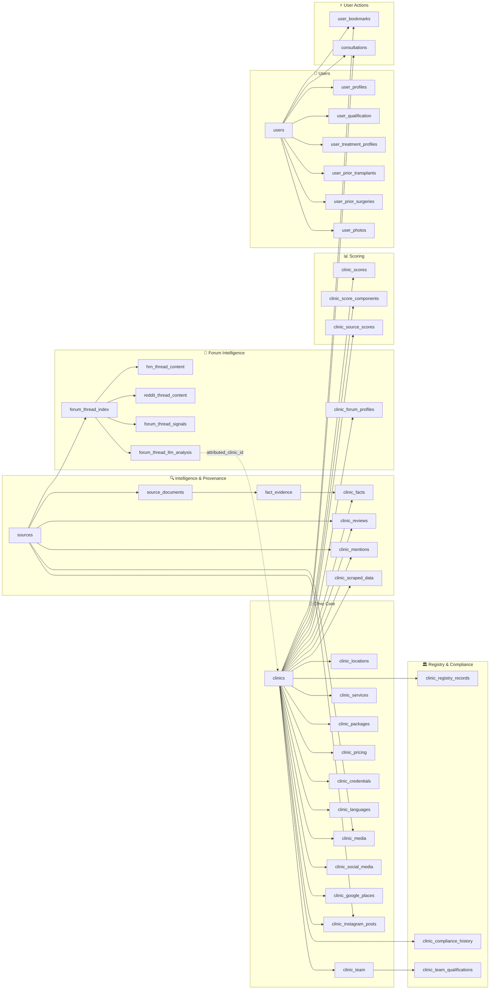

# Database Overview

**Platform:** Supabase (hosted PostgreSQL)  
**Client:** `@supabase/supabase-js` v2 — no ORM, raw SQL migrations  
**Type safety:** Generated TypeScript types at `lib/supabase/database.types.ts` (`npm run db:types`)  
**Migrations:** `/supabase/migrations/` — 26 migration files from Feb 2026 → May 2026  
**Tables:** 41 tables across 7 domains + 1 view + 2 PL/pgSQL functions

---

## Architecture Diagram

---

## Domain Breakdown

### 1. Clinic Core

The central entity is `clinics`. Everything in this domain hangs off it via FK with `ON DELETE CASCADE`.

| Table | Purpose |
|---|---|
| `clinics` | Root entity. One row per clinic. Holds identity fields: name, city, website, contact info, thumbnail, status. |
| `clinic_locations` | Physical addresses with coordinates, opening hours (jsonb), and payment methods. A clinic can have multiple locations; `is_primary` flags the main one. |
| `clinic_team` | Staff roster. Each member has a `role` enum (surgeon, coordinator, nurse, etc.), a `doctor_involvement_level`, and verified identity fields (`name_normalized`, `external_ids`, `last_verified_at`) added during the doctor verification pipeline. |
| `clinic_services` | What procedures a clinic offers, typed by `service_category` and `service_name` enums. Intentionally lightweight — just a signal, not a price list. |
| `clinic_packages` | All-in packages (grafts, nights, transport, aftercare, price range). Structured separately from pricing because packages bundle multiple things that don't map cleanly to a single service price. |
| `clinic_pricing` | Per-service price ranges. Sourced and verified separately from packages. Currently unpopulated — data is pending scraper runs. |
| `clinic_credentials` | Licenses, accreditations, memberships (e.g. ISHRS, JCI). Distinct from doctor qualifications which live in `clinic_team_qualifications`. |
| `clinic_languages` | Which languages a clinic supports and how (staff, translator, on-request). |
| `clinic_media` | Images, videos, before/after photos. Unique constraint on `(clinic_id, url)`. One primary image enforced via partial unique index. |
| `clinic_social_media` | Per-platform social account data (handle, follower count, verified status, bio). Unique on `(clinic_id, platform, account_handle)`. |
| `clinic_google_places` | Google Maps data (place ID, star rating, review count). Kept separate from `clinics` because it's sourced/refreshed independently and a clinic could theoretically have multiple Google listings. |
| `clinic_instagram_posts` | Full scraped post data (likes, comments, hashtags, display URL, engagement). Linked to both `clinics` and `sources`. Unique on `(clinic_id, instagram_post_id)`. |

---

### 2. Intelligence & Provenance

This domain tracks *where data came from* and *what we learned from it*. The design intention is full auditability — every fact has a traceable source.

| Table | Purpose |
|---|---|
| `sources` | A single scraped URL/document capture. Typed by `source_type` (forum, registry, review platform, clinic website, etc.). `content_hash` unique constraint prevents duplicate ingestion. |
| `source_documents` | The actual content extracted from a source (raw text, HTML, PDF). Separated from `sources` because a single URL visit can yield multiple documents. |
| `clinic_facts` | **EAV (Entity–Attribute–Value) table.** One row per `(clinic_id, fact_key)`. Holds heterogeneous scraped intelligence — Google ratings, Instagram metrics, opening hours presence, etc. The custom `upsert_clinic_facts()` function preserves `first_seen_at` while updating `last_seen_at` on conflict. |
| `fact_evidence` | Links a clinic fact back to the specific source document snippet that supports it. Provides drill-down traceability. |
| `clinic_reviews` | Structured review rows (rating + text + date) linked to both a clinic and a source. Unique on `(clinic_id, source_id, review_text, review_date)`. |
| `clinic_mentions` | Unstructured mentions of a clinic found in scraped content, tagged by topic (pricing, results, complaint, praise, etc.) and sentiment. `clinic_id` is nullable — a mention may be scraped before clinic attribution is resolved. |
| `clinic_scraped_data` | Raw staging table for scraper output before it's normalized into structured tables. ~35 columns covering all scraped attributes. Uses `bigserial` PK (inconsistent with the rest of the schema — see Weaknesses). |

---

### 3. Forum Intelligence

The most architecturally interesting domain. Designed to handle multiple forum sources (HRN, Reddit, RealSelf) with very different content structures without collapsing them into a single bloated table.

| Table | Purpose |
|---|---|
| `forum_thread_index` | **Hub table.** One row per thread regardless of source. Holds the fields all forum sources share: URL, title, author, date, reply count, clinic attribution. |
| `hrn_thread_content` | **HRN-specific extension** (1:1 with `forum_thread_index`). Holds HRN-only fields: section ID, view count, total pages, OP text/HTML, image URLs, scrape strategy, sitemap metadata. |
| `reddit_thread_content` | **Reddit-specific extension** (1:1 with `forum_thread_index`). Holds Reddit-only fields: subreddit, `post_type` (post vs comment), body, score, is_firsthand, and `parent_thread_id` FK (links comment rows back to their parent post's index entry). |
| `forum_thread_signals` | **EAV for deterministic signals.** Per-thread signals extracted by regex/keyword matching (e.g. graft count mentioned, clinic name present, photo count). Versioned by `extraction_version`. |
| `forum_thread_llm_analysis` | **LLM-derived analysis per thread.** Attributed clinic/doctor, sentiment label, satisfaction label, summary, topics, issue keywords, repair case flag, sentiment score. `is_current` flag allows historical versioning as models are updated. |
| `clinic_forum_profiles` | **Aggregated per-clinic-per-source summary.** Thread counts, mention counts, sentiment distribution, pros/concerns, notable threads. Computed from the raw thread data and stored here so the frontend doesn't need to aggregate across thousands of rows at query time. |

---

### 4. Scoring

Three-layer scoring architecture designed to be transparent and debuggable.

| Table | Purpose |
|---|---|
| `clinic_score_components` | **Layer 1 — raw components.** Named component scores (currently `reputation` at weight 0.6 and `evidence_transparency` at weight 0.4). Unique on `(clinic_id, component_key)` to prevent concurrent scoring races. |
| `clinic_source_scores` | **Layer 2 — per-source breakdowns.** Scores per source (google / reddit / instagram) with `metrics_json` and `breakdown_json` for explainability. `is_current` flag allows versioning. |
| `clinic_scores` | **Layer 3 — overall roll-up.** One row per clinic (PK = `clinic_id`). Overall score 0–100, band A/B/C/D. |
| `clinics_with_scores` *(view)* | `clinics` LEFT JOIN `clinic_scores` LEFT JOIN `clinic_google_places`. Used by the listing page for DB-level `ORDER BY score`. |

---

### 5. Registry & Compliance

| Table | Purpose |
|---|---|
| `clinic_registry_records` | Turkish Ministry of Health license records. License number, status, specialties, legal name, registry URL. Unique on `(clinic_id, source, license_number)`. |
| `clinic_compliance_history` | Historical compliance events: disciplinary actions, suspensions, fines, reinstatements. Immutable append-only log — rows are never updated. |
| `clinic_team_qualifications` | Doctor-level credential verification. Links a team member to an external registry (ISHRS, IAHRS, TPRECD) with a source URL and verified date. Unique on `(team_member_id, source)` — one badge per registry per doctor. **Only table with RLS enabled.** |

---

### 6. Users

User onboarding data, split across several tables by concern. All tables have `deleted` soft-delete columns and `update_updated_at_column()` triggers.

| Table | Purpose |
|---|---|
| `users` | Auth bridge. `auth_id` stores the Supabase auth UID. One row per registered user. |
| `user_profiles` | Personal info: name (nullable — Google OAuth may not return one), DOB, gender, nationality, timezone, profile picture. 1:1 with `users`. |
| `user_qualification` | Onboarding wizard answers: age tier, country, hair loss pattern, budget, timeline, WhatsApp number. 1:1 with `users`. |
| `user_treatment_profiles` | Medical profile: Norwood scale, donor area quality/availability, prior transplant flag, allergies, medications. 1:1 with `users`. |
| `user_prior_transplants` | History of previous transplants (year, grafts, country). 1:many with `users`. |
| `user_prior_surgeries` | History of other relevant surgeries. 1:many with `users`. |
| `user_photos` | Hair photos for assessment (front, left side, right side, top, donor area). Unique on `(user_id, photo_view)` — one photo per angle. Stored in Supabase Storage bucket `user-photos`. |

---

### 7. User Actions

| Table | Purpose |
|---|---|
| `user_bookmarks` | Saved clinics. Unique on `(user_id, clinic_id)`. |
| `consultations` | Consultation requests. `status` enum: pending → in_progress → completed/cancelled. Partial unique index enforces one pending consultation per `(user_id, clinic_id)` — prevents duplicate open requests while allowing historical records. |

---

## Architecture Decisions

### EAV for `clinic_facts`
Scraped intelligence is heterogeneous — a fact about a clinic's Instagram engagement rate and one about its Google rating have nothing structurally in common. A fixed-column table would require constant schema migrations every time a new signal is added. EAV lets the scraper define new fact keys without touching the schema. The tradeoff is weaker type enforcement per fact (mitigated by the `value_type` enum + `fact_value` jsonb pairing).

### Hub-and-spoke for forum tables
Reddit and HRN threads have almost no overlapping fields beyond "there's a thread at a URL". Rather than one `forum_threads` table with 30 nullable columns, the hub (`forum_thread_index`) holds the universal fields and each platform gets its own 1:1 extension table with only its specific fields. Adding a new forum source (e.g. RealSelf, Quora) means adding one new extension table without touching the hub.

### Pre-aggregated `clinic_forum_profiles`
The alternative — computing thread counts, sentiment distributions, and notable threads at query time — would require aggregating across thousands of forum rows on every page load. `clinic_forum_profiles` acts as a materialised summary computed by the pipeline and stored. The frontend reads one row per clinic instead of joining and aggregating at runtime.

### Layered scoring (`components` → `source_scores` → `overall`)
Rather than a single opaque score, the pipeline writes three levels. This makes the score auditable: you can see that Clinic X scored 88 because `reputation` (sourced from Google + Reddit signals) was 91 and `evidence_transparency` was 83, and drill further into why Reddit gave a 7.6/10. It also lets components be recomputed independently.

### Versioned LLM analysis
`forum_thread_llm_analysis` rows are never updated — new model runs insert a new row and flip `is_current`. This means if a model update changes a clinic's attributed sentiment, the old analysis is preserved for comparison. Same pattern applies to `clinic_source_scores.is_current`.

### Seed data in migrations
Real clinic rows (27 clinics, 47 doctors) are inserted inside migration files, not a separate seed script. This means a fresh `supabase db reset` gives you a fully working database without a separate seed step. The inserts use `ON CONFLICT DO NOTHING` so they're safe to run against production.

---

## Strengths

- **Full source traceability.** Every fact, review, and score can be traced back to a source URL via `sources` → `source_documents` → `fact_evidence` → `clinic_facts`.
- **Extensible forum architecture.** Adding a new forum source requires only a new extension table, not a schema change to existing tables.
- **Score auditability.** Three-layer scoring means no black-box scores — every number is explainable to the component level.
- **Idempotent migrations.** Real data is seeded via migrations with conflict guards, making local setup and prod deploys safe to replay.
- **jsonb for semi-structured fields.** `opening_hours`, `includes/excludes` in packages, `metrics_json` in scores, `evidence_snippets` in LLM analysis — all use jsonb where a fixed schema would be premature. The fields that warrant structure have it; the rest don't.
- **Soft deletes on user data.** All user tables have `deleted` flags, which is the right call for medical/GDPR-adjacent data.

---

## Weaknesses & Known Debt

| Issue | Severity | Notes |
|---|---|---|
| **RLS disabled on 40/41 tables** | Critical (before launch) | Only `clinic_team_qualifications` has RLS. `users`, `user_profiles`, `user_qualification`, `user_treatment_profiles`, `user_photos`, `consultations`, and `user_bookmarks` need row-level policies before real users touch the app. Clinic tables can stay grant-based (they're public read-only data) but user-owned tables must not be. |
| **`users.auth_id` is `text`, not a FK** | High | Should be `REFERENCES auth.users(id) ON DELETE CASCADE`. The current `text` column allows orphaned `public.users` rows if a Supabase auth user is deleted, and loses referential integrity. |
| **EAV ↔ structured table boundary is implicit** | Medium | `clinic_facts` holds scraped signals (Google rating, Instagram metrics). `clinic_google_places` and `clinic_social_media` hold canonical structured versions of some of the same data. The rule ("facts = intelligence signals, structured tables = entity data") is correct but lives only in developers' heads, not in any constraint or comment. |
| **`analyses` table is an orphan** | Low | No FK to any domain entity, 0 rows, carried over from a separate code-analysis tool. Should be dropped in a future migration. |
| **`clinic_scraped_data` uses `bigserial` PK** | Low | Every other table uses UUID. This staging table can't participate in FK relationships with the rest of the schema. Fine while it's purely a scraper staging area, but worth normalising if it ever becomes a first-class entity. |
| **Only 2 score components populated** | Low | The scoring infrastructure supports arbitrary component keys, but only `reputation` and `evidence_transparency` exist. The architecture is ahead of the current computation — not a bug, but the pipeline has room to grow. |
