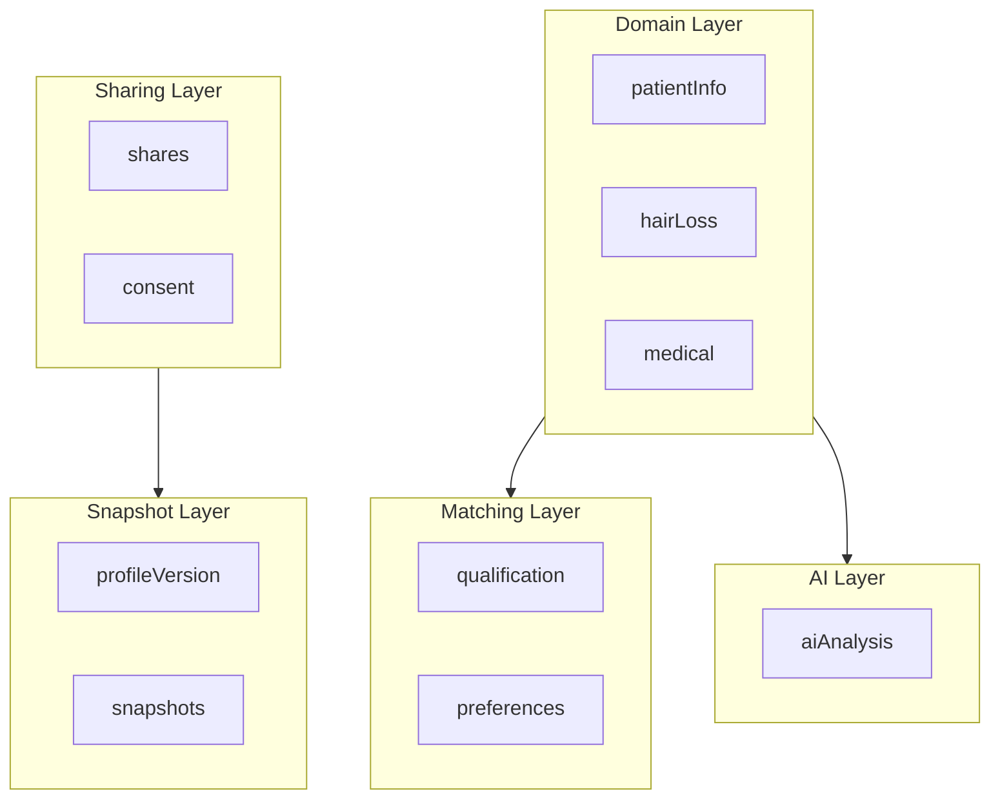

# Patient Profile — Scalable Architecture

Treatment Passport schema for IstanbulMedic Connect. Production-grade structure with separated domain/matching/AI/sharing layers.

## Design Principles

- **Domain vs UI** — Store domain data only; compute completion, progress, derived values
- **Layered model** — Domain, Matching, AI Analysis, Sharing, Snapshot are distinct concerns
- **Strict enums** — Use typed enum strings for filtering and consistency
- **Versioning** — Profile versions, AI analysis versions, snapshot versions for audit trail
- **Consent** — Required for sharing medical data; track version and timestamp

---

## Layered Architecture

---

## Layer Summary

| Layer | Fields | Purpose |
|-------|--------|---------|
| **Patient Info** | fullName, email, phone, preferredContactMethod, timezone, preferredLanguage | Contact and identity |
| **Qualification** | ageTier, gender, country, budgetTier, timeline, hairLossPattern | Clinic matching (enums, no arrays) |
| **Hair Loss** | norwoodScale, durationYears, familyHistory, previousTreatments, priorTransplants, donorQuality | Domain data |
| **Medical** | allergies, medications, bloodThinners, smokingStatus, alcoholUse, chronicConditions, etc. | Safety-relevant |
| **Photos** | Stored in `patient_photos` table; references by ID | Separate model |
| **AI Analysis** | version, generatedAt, graft estimates, scores, riskFlags | Versioned |
| **Status** | stage, subStage, updatedBy, source | Workflow |
| **Consent** | consentGiven, consentTimestamp, consentVersion, dataSharingConsent | Legal |
| **Sharing** | shares[] with clinicId, snapshotVersion, status, viewedAt | Per-clinic audit |
| **Preferences** | travelFlexibility, packagePreference | Matching |

---

## Removed (Computed, Not Stored)

- `sections` — Compute from presence of required fields
- `completionPercent` — Compute from section completeness

---

## Supabase Tables

| Table | Purpose |
|-------|---------|
| `patient_profiles` | Core profile (id, user_id, qualification, hair_loss, medical, patient_info, consent, status, profile_version, created_at, updated_at) |
| `patient_photos` | Photos with view, url, ai metadata |
| `patient_ai_analyses` | Versioned AI runs (profile_id, version, generated_at, ...) |
| `patient_profile_shares` | Shares with clinic_id, snapshot_version, status, viewed_at |
| `patient_profile_snapshots` | Frozen profile JSON per share version |

---

## Related Files

- [patient-profile-example.json](./patient-profile-example.json) — Full example
- [patient-profile.schema.json](./patient-profile.schema.json) — JSON Schema
- [../../types/patient-profile.ts](../../types/patient-profile.ts) — TypeScript interfaces
